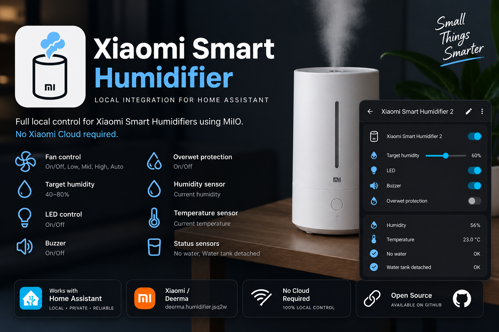

  

# Xiaomi Smart Humidifier for Home Assistant

A fully local Home Assistant integration for **Xiaomi Smart Humidifier 2 / Xiaomi Humidifier 2 / Xiaomi Smart Humidifier 2 EU**, including the Deerma model identifier **`deerma.humidifier.jsq2w` (JSQ2W)**.

**No Xiaomi Cloud is required for normal operation.**

  

## Supported devices

### Xiaomi Smart Humidifier 2

**Tested and confirmed working on a real device:**

| Product | Model / identifier | Status |
| --- | --- | --- |
| Xiaomi Smart Humidifier 2 | `deerma.humidifier.jsq2w` | ✅ Tested |
| Xiaomi Humidifier 2 | `deerma.humidifier.jsq2w` | ✅ Tested |
| Xiaomi Smart Humidifier 2 EU | `deerma.humidifier.jsq2w` | ✅ Tested |
| Deerma JSQ2W | `deerma.humidifier.jsq2w` | ✅ Tested |

The first public version deliberately targets **JSQ2W** only. Other Xiaomi / Deerma humidifiers are not claimed as supported until they are tested.

## Why this integration?

The integration communicates directly with the humidifier over the local network using MiIO. Once configured, Home Assistant does not need Xiaomi Cloud credentials for normal control or status polling.

All entities are grouped under **one Home Assistant device** instead of exposing only a fan entity with additional attributes.

## Features

- Fan power control
- Preset modes: **Low / Mid / High / Auto**
- Target humidity: **40–80%**
- LED on/off
- Buzzer on/off
- Overwet protection on/off
- Current humidity
- Current temperature
- No-water status
- Water-tank-detached status
- Home Assistant Device Registry support
- Local polling
- Config flow setup from the Home Assistant UI

## Requirements

You need:

- Xiaomi Smart Humidifier 2 / Deerma JSQ2W
- The humidifier's local IP address
- Its 32-character MiIO token
- Home Assistant with network access to the humidifier

For best reliability, reserve the humidifier's IP address in your router or DHCP server.

## Installation with HACS

Until this repository is available in the default HACS store:

1. Open HACS.
2. Open **Custom repositories**.
3. Add this repository as an **Integration**.
4. Install **Xiaomi Smart Humidifier**.
5. Restart Home Assistant.
6. Go to **Settings → Devices & services → Add integration**.
7. Search for **Xiaomi Smart Humidifier**.
8. Enter the local IP address and 32-character MiIO token.

## Manual installation

Copy:

`custom_components/rapway_xiaomi_humidifier`

to:

`/config/custom_components/rapway_xiaomi_humidifier`

Restart Home Assistant and add **Xiaomi Smart Humidifier** from **Settings → Devices & services**.

## Local operation and privacy

Normal operation is local:

**Home Assistant ⇄ LAN ⇄ Xiaomi Smart Humidifier 2**

The integration does not require your Xiaomi account username or password and does not depend on Xiaomi Cloud for normal polling and control.

## Updating from the early test build

The internal integration domain remains `rapway_xiaomi_humidifier`, preserving compatibility with the original test build. Existing config entries therefore do not need to be recreated when updating the component files.

## Known limitations

- Officially tested only with `deerma.humidifier.jsq2w` / JSQ2W.
- Obtaining the MiIO token is currently outside the scope of the integration.
- The humidifier must remain reachable from the Home Assistant host over the LAN.

## Credits

Built using the excellent [`python-miio`](https://github.com/rytilahti/python-miio) project and inspired by the Xiaomi device support work of the Home Assistant community.

## License

MIT
